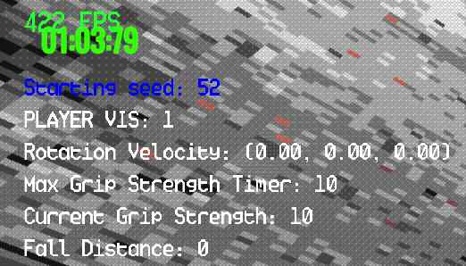

# IShowSeed

Set and show seed in all gamemodes, persistent between game restarts. Disables achievements and leaderboards updates.

### What is added?
Set and show seed. Press `ctrl + shift + S` at the main menu to set the seed. Replace by `0` or empty prompt to keep random.

View seed ingame via Debug Menu (`F5`)

Seed shown at the end of the run:

### What is affected by the seed?

Things that stay the same with same seed:
- Levels generation (rooms)
- Props on the ground (like pitons, rebars, etc.)
- Perks & Buffs (temporary and permanent)

Things that are still somewhat random:
- Vending Machines with items will have random loot every run
- Roaches
- Enemies
    - turrets seem to spawn in an area defined by seed, but the exact spot will still be random
    - barnacle tongues will still be random
    - bugs/drones spawn is completely random (?)
- Piton rotation when placed (it does not matter)
- Something else?
