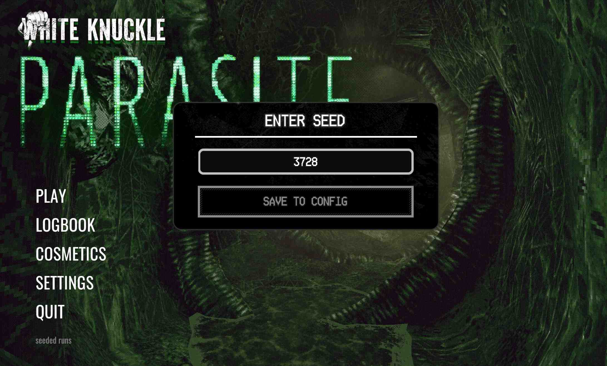

# IShowSeed

Seed worshipper. Consistent runs. Set and show seed in all gamemodes, persistent between game restarts. Disables achievements and leaderboards.

### What is added?
Set and show seed. Press `ctrl + shift + S` at the main menu to set the seed. Replace by `0` or empty prompt to keep random.

View seed ingame via Debug Menu (`F5`)

Seed shown at the end of the run:

### What is affected by the seed?

Things that stay the same with same seed:
- Levels generation (rooms)
- Props on the ground (like pitons, rebars, etc.)
- Perks & Buffs (temporary and permanent)
- Vending Machines with items have persistent spawn and items
- Enemies spawn

Being tested (may or may not work):
- Roaches
- Turrets
- barnacle tongues
- events (fog, drone spawns)

Known not-working stuff:
- yet to find out

### Found a bug? Something is broken?

You can find me on the official White Knuckle Discord server and provide the info / request any features. You can also make PRs on GitHub.
